# Gradient — Complete Technical Architecture

> **Gradient** is an autonomous software engineering platform. Users label a Linear issue with `gradient-agent`, and the system provisions a cloud environment, clones the repo, runs Claude Code headless, creates a PR, and reports back — all without human intervention.

---

## Table of Contents

1. [Bird's Eye View](#1-birds-eye-view)
2. [System Components Map](#2-system-components-map)
3. [User-Facing Flow: Issue to PR](#3-user-facing-flow-issue-to-pr)
4. [API Server (`gradient-api`)](#4-api-server)
5. [Authentication and Authorization](#5-authentication-and-authorization)
6. [Task Pipeline: End to End](#6-task-pipeline-end-to-end)
7. [Environment Lifecycle](#7-environment-lifecycle)
8. [Cloud Providers (AWS & Hetzner)](#8-cloud-providers)
9. [Warm Pool](#9-warm-pool)
10. [Claude Code Execution](#10-claude-code-execution)
11. [Live Context Mesh (NATS)](#11-live-context-mesh)
12. [MCP Servers](#12-mcp-servers)
13. [Context Version Control](#13-context-version-control)
14. [Gradient Agent (`gradient-agent`)](#14-gradient-agent)
15. [Linear Integration](#15-linear-integration)
16. [GitHub Integration](#16-github-integration)
17. [Billing and Stripe](#17-billing-and-stripe)
18. [Frontend Architecture](#18-frontend-architecture)
19. [Database Schema](#19-database-schema)
20. [CLI (`gc`)](#20-cli)
21. [Configuration Reference](#21-configuration-reference)

---

## 1. Bird's Eye View

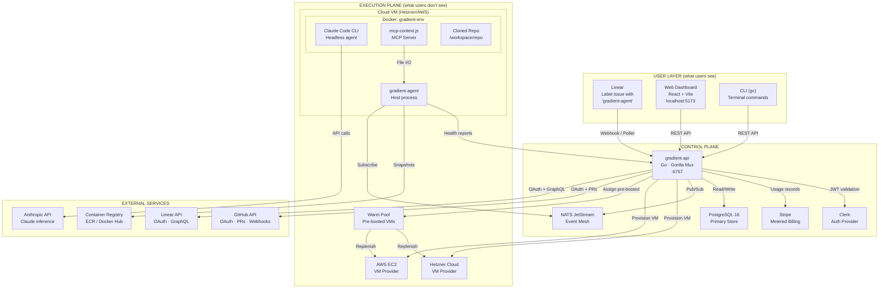

**What users see:** A Linear issue turns into a GitHub PR. They can watch progress in the dashboard.

**What users don't see:** Environment provisioning, Docker containers, Claude Code running headless, context mesh synchronization, snapshot management, warm pool replenishment.

---

## 2. System Components Map

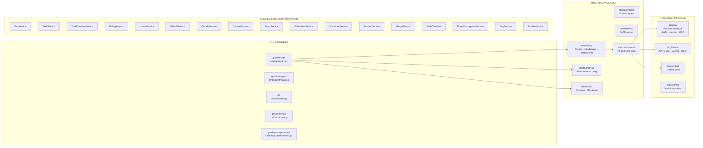

| Binary | Entry Point | Purpose |
|--------|-------------|---------|
| `gradient-api` | `cmd/api/main.go` | HTTP API server. Loads config, connects DB, runs migrations, starts router on `:6767` |
| `gradient-agent` | `cmd/agent/main.go` | Host-level agent on cloud VMs. Snapshots, health, context mesh, change detection |
| `gc` | `cmd/cli/main.go` | CLI tool. Env, task, billing, context, repo, auth, integration commands |
| `gradient-mcp` | `cmd/mcp/main.go` | MCP server for IDE integration. Proxies CLI commands as MCP tools |
| `gradient-mcp-context` | `cmd/mcp-context/main.go` | In-container MCP server. `get_context_updates` and `publish_event` via files |

---

## 3. User-Facing Flow: Issue to PR

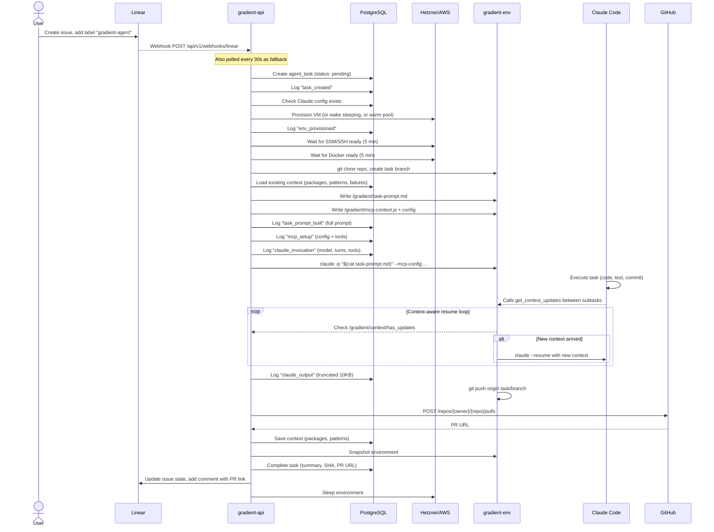

---

## 4. API Server

### Server Initialization (`cmd/api/main.go`)

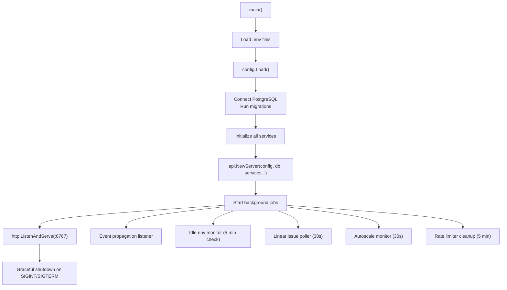

### Route Map

All authenticated routes require `Authorization: Bearer <token>` and resolve org via JWT claims or `X-Org-ID` header.

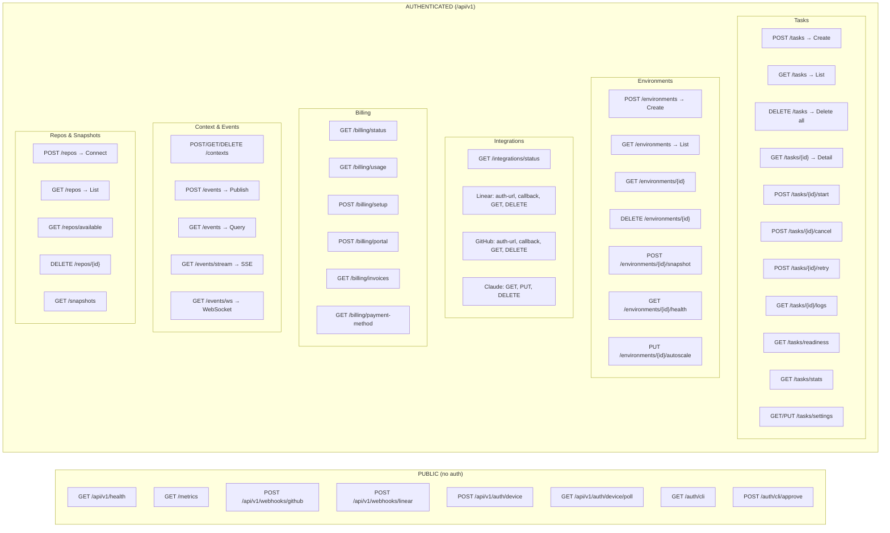

### Middleware Stack

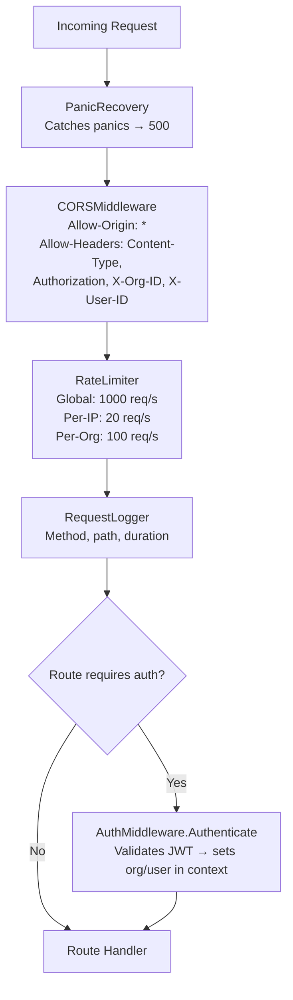

---

## 5. Authentication and Authorization

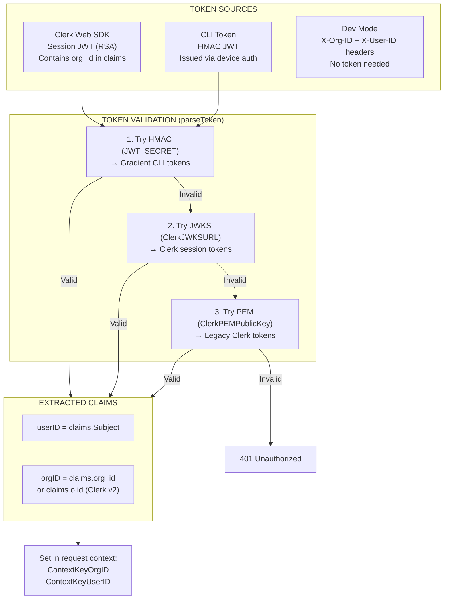

### Clerk Integration

| Component | Purpose |
|-----------|---------|
| `CLERK_SECRET_KEY` | Backend token validation |
| `CLERK_JWKS_URL` | Auto-fetches Clerk's public keys for RSA validation |
| `CLERK_PEM_PUBLIC_KEY` | Legacy static PEM key (fallback) |
| `CLERK_PUBLISHABLE_KEY` | Frontend SDK initialization |

The frontend uses Clerk's React SDK (`@clerk/clerk-react`) for sign-in/sign-up/org switching. Clerk returns session JWTs that include the active organization ID. The backend validates these via JWKS.

### CLI Device Auth Flow

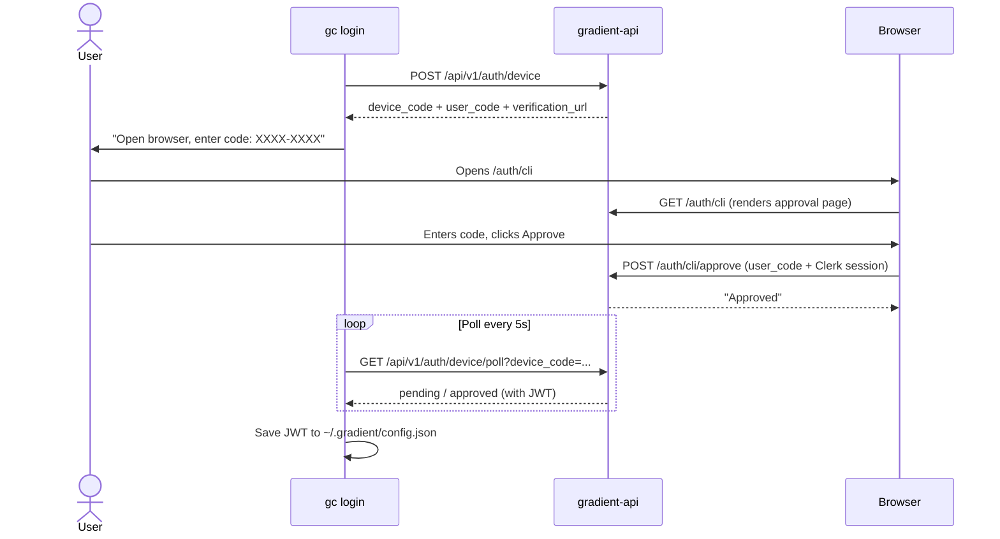

---

## 6. Task Pipeline: End to End

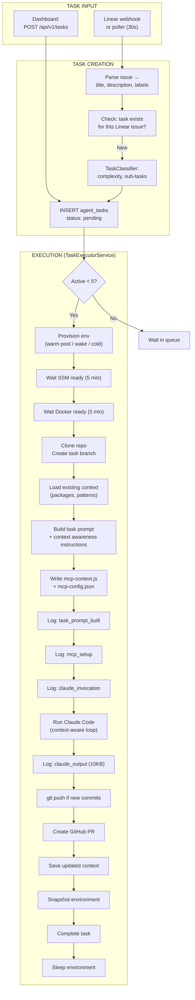

### Task States

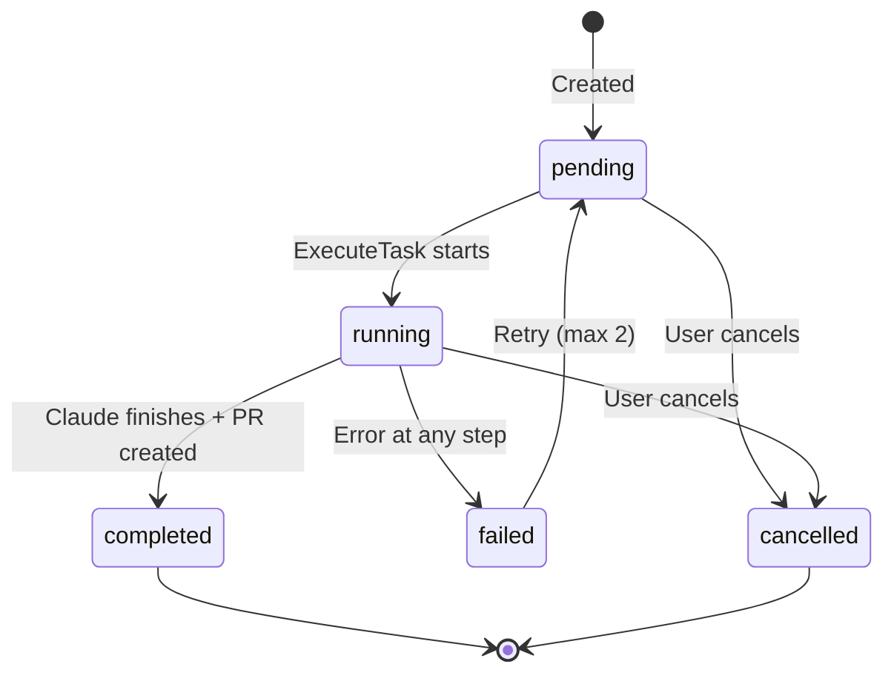

### Execution Logging

Every step writes to `task_execution_log` (visible in dashboard task detail):

| Step | Status | Content |
|------|--------|---------|
| `task_prompt_built` | completed | Full prompt text (4KB), metadata: prompt_length, has_context, repo, branch |
| `mcp_setup` | completed | MCP config JSON, tools list, file paths |
| `claude_invocation` | started | Full CLI command (API key redacted), metadata: model, max_turns, turns_per_iteration, max_iterations, allowed_tools, mcp_enabled |
| `claude_output` | completed | Full Claude output (10KB truncated), metadata: output_bytes, truncated, had_error |
| `claude_done` | completed | Summary: byte count |
| `push_failed` / `push_skipped` | failed/completed | Push result or reason for skip |
| `pr_created` / `pr_failed` | completed/failed | PR URL or error |

---

## 7. Environment Lifecycle

```mermaid
stateDiagram-v2
    [*] --> creating: CreateEnvironment
    creating --> running: VM + Docker ready
    creating --> failed: Timeout or error
    running --> sleeping: SleepEnvironment
    sleeping --> running: WakeEnvironment
    running --> destroyed: DestroyEnvironment
    sleeping --> destroyed: DestroyEnvironment
    failed --> destroyed: Cleanup
    destroyed --> [*]

    note right of creating: Cold boot: 2-6 min\nWarm pool: 5-15s
    note right of sleeping: Snapshot taken\nVM stopped\nNo cost
    note right of running: Billing active
```

### Environment Creation Flow

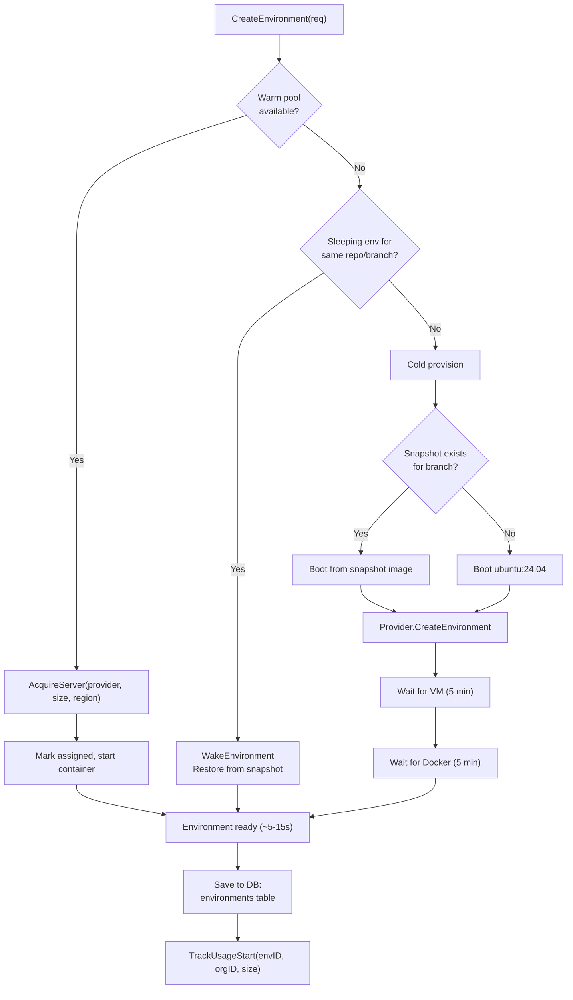

---

## 8. Cloud Providers

### Provider Interface

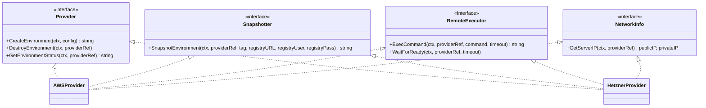

### AWS EC2 Flow

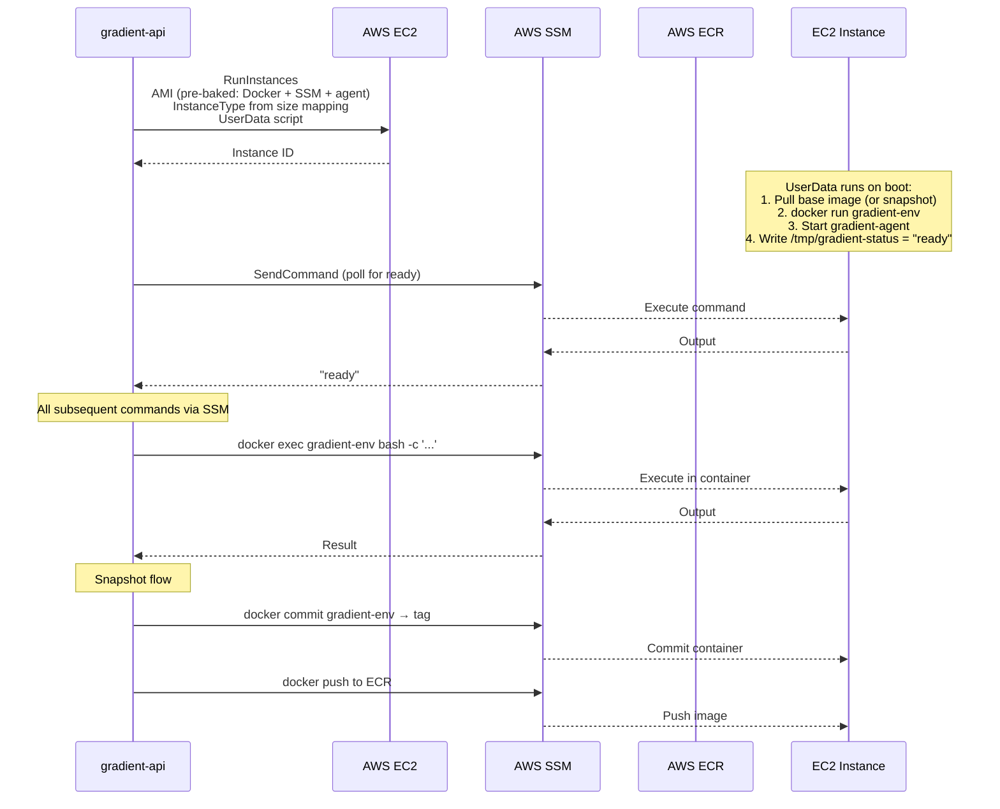

**Size → Instance Type mapping:**
| Size | EC2 Type | Specs |
|------|----------|-------|
| small | t3.medium | 2 vCPU, 4 GB |
| medium | t3.xlarge | 4 vCPU, 16 GB |
| large | m5.2xlarge | 8 vCPU, 32 GB |
| gpu | g4dn.xlarge | GPU, 16 GB VRAM |

### Hetzner Cloud Flow

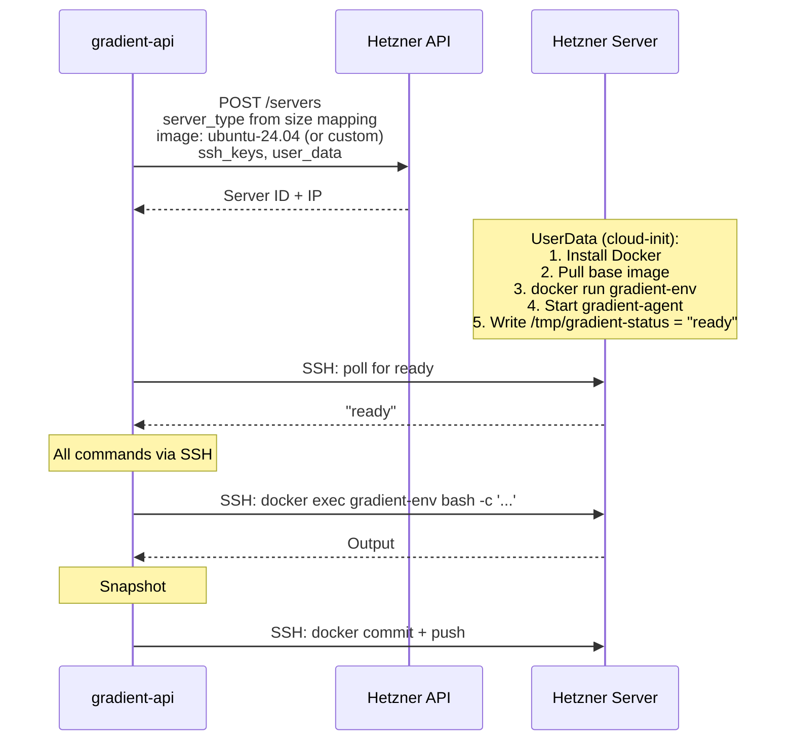

**Size → Server Type mapping:**
| Size | Hetzner Type | Specs | Cost |
|------|-------------|-------|------|
| small | cx22 | 2 vCPU, 4 GB | ~$0.03/hr |
| medium | cx32 | 4 vCPU, 16 GB | ~$0.08/hr |
| large | cx42 | 8 vCPU, 32 GB | ~$0.17/hr |
| gpu | N/A | Not supported | — |

---

## 9. Warm Pool

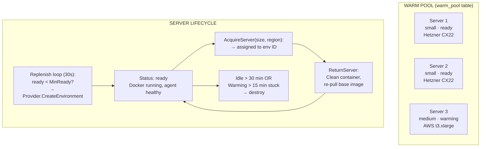

### Configuration

| Env Var | Default | Description |
|---------|---------|-------------|
| `WARM_POOL_DEFAULT_SIZE` | 3 | Target number of warm servers |
| `WARM_POOL_MAX_SIZE` | 3 (hard max: 8) | Maximum warm servers |
| `WARM_POOL_IDLE_TIMEOUT` | 30m | Destroy idle servers after |

### Cost Math (Hetzner CX22)

| Servers | Daily | Monthly |
|---------|-------|---------|
| 1 | ~$0.80 | ~$24 |
| 3 (default) | ~$2.40 | ~$72 |
| 5 | ~$4.00 | ~$120 |
| 8 (max) | ~$6.40 | ~$192 |

**Key design choice:** Customers are billed from `assigned_at`, not from when the server was booted. Idle warm pool cost is Gradient's cost.

---

## 10. Claude Code Execution

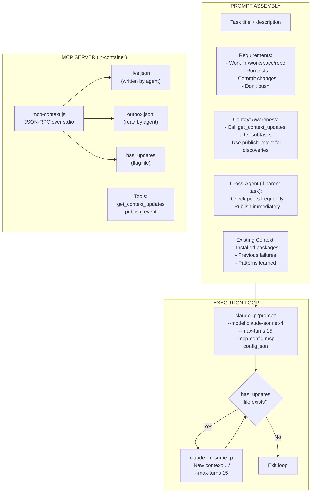

### Claude Script (generated by `buildClaudeScript`)

```bash
export ANTHROPIC_API_KEY="sk-ant-..." && cd /workspace/repo

# Initial run (up to 15 turns per iteration)
claude -p "$(cat /gradient/task-prompt.md)" \
  --output-format text \
  --model claude-sonnet-4-20250514 \
  --max-turns 15 \
  --allowedTools "Edit,Write,Bash,Read" \
  --mcp-config /gradient/mcp-config.json \
  --verbose 2>&1

# Context-aware resume loop
ITER=1
MAX_ITER=4  # ceil(50/15), capped at 10
FLAG="/gradient/context/has_updates"

while [ $ITER -lt $MAX_ITER ]; do
  if [ ! -f "$FLAG" ]; then break; fi
  rm -f "$FLAG"
  CONTEXT=$(cat /gradient/context/live.json 2>/dev/null | head -c 2000)
  if [ -z "$CONTEXT" ]; then break; fi
  echo "[gradient] Context update detected, resuming..."
  claude --resume -p "New context: $CONTEXT" \
    --output-format text --model claude-sonnet-4-20250514 \
    --max-turns 15 --allowedTools "Edit,Write,Bash,Read" \
    --mcp-config /gradient/mcp-config.json --verbose 2>&1
  ITER=$((ITER+1))
done
```

### MCP Context Server (`mcp-context.js`)

Runs inside the container. Uses `fs.watchFile` to detect changes to `live.json`:

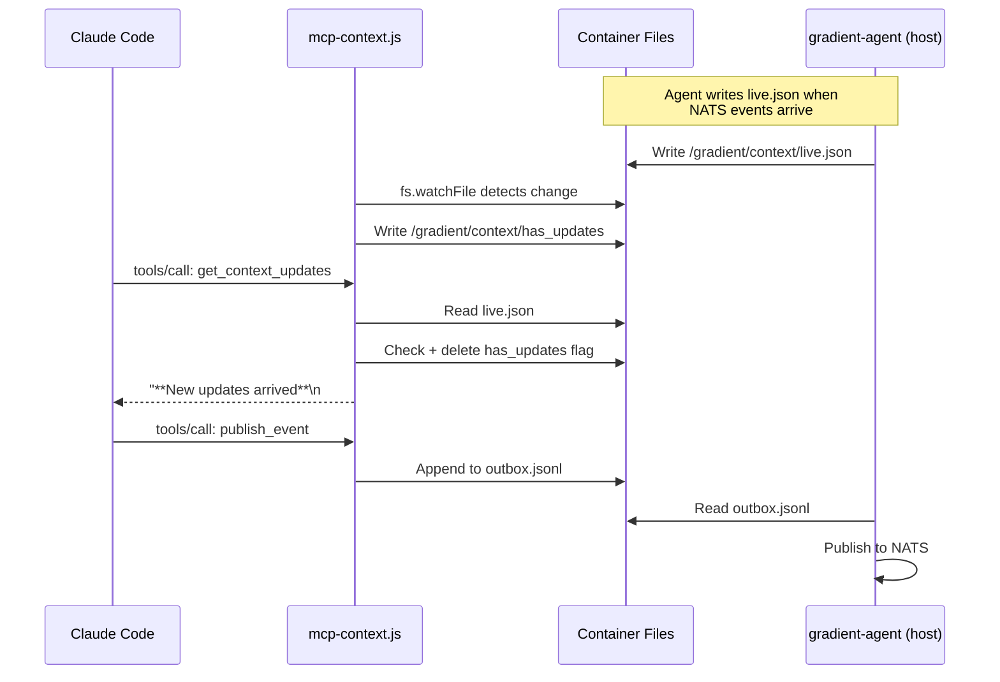

---

## 11. Live Context Mesh

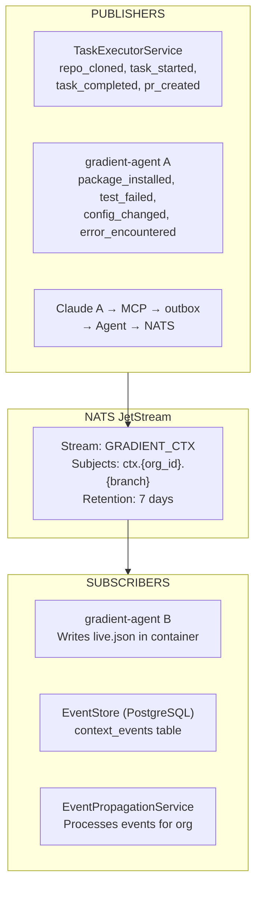

### Event Types

| Type | Source | Data |
|------|--------|------|
| `package_installed` | Agent change watcher | name, version, manager |
| `package_removed` | Agent change watcher | name, manager |
| `test_failed` | Agent / Claude | test, error, file, line |
| `test_fixed` | Agent / Claude | test, fix |
| `pattern_learned` | Claude | pattern, description |
| `config_changed` | Agent | key, old_value, new_value |
| `error_encountered` | Claude / Agent | error, context, file |
| `command_ran` | Agent | command, exit_code, output |
| `file_changed` | Agent | path, change_type |
| `pr_created` | Executor | pr_url, head, base, task_id |
| `custom` | Any | key, value |

### Event Flow

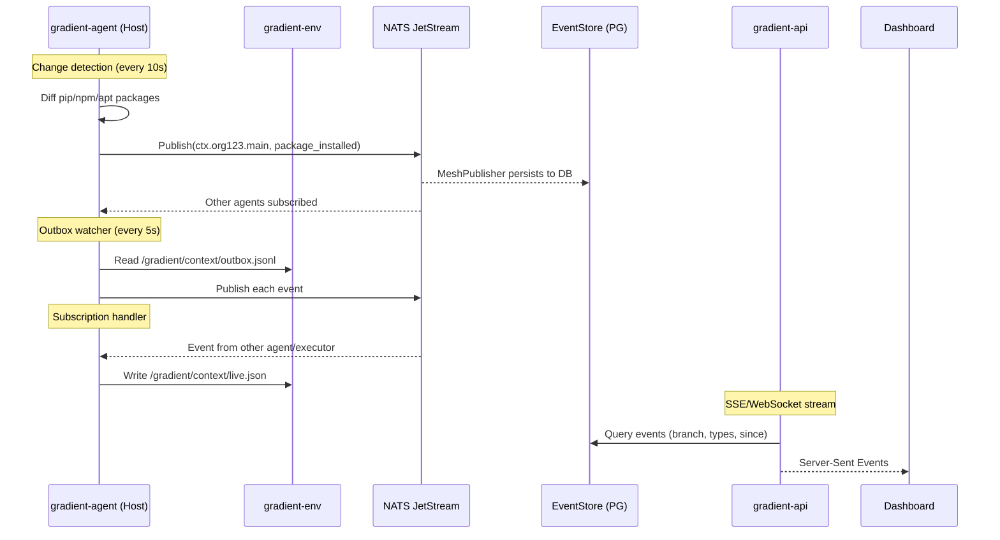

---

## 12. MCP Servers

Gradient has two MCP servers for different contexts:

### 1. `gradient-mcp` (IDE Integration)

```mermaid
flowchart LR
    IDE["IDE / Claude Desktop"] -->|JSON-RPC stdio| MCP["gradient-mcp<br/>cmd/mcp/main.go"]
    MCP -->|REST API calls| API["gradient-api"]

    subgraph Tools["AVAILABLE TOOLS"]
        T1["gradient_env_create"]
        T2["gradient_env_list"]
        T3["gradient_env_destroy"]
        T4["gradient_env_status"]
        T5["gradient_env_snapshot"]
        T6["gradient_context_get"]
        T7["gradient_context_save"]
        T8["gradient_context_events"]
        T9["gradient_context_publish"]
        T10["gradient_repo_connect"]
        T11["gradient_repo_list"]
        T12["gradient_snapshot_list"]
        T13["gradient_billing_usage"]
        T14["gradient_mesh_health"]
        T15["gradient_env_autoscale"]
    end

    MCP --> Tools
```

### 2. `gradient-mcp-context` (In-Container)

```mermaid
flowchart LR
    Claude["Claude Code<br/>(in container)"] -->|JSON-RPC stdio| MCP["mcp-context.js<br/>or cmd/mcp-context"]
    MCP -->|Read| Live["live.json"]
    MCP -->|Read+Clear| Flag["has_updates"]
    MCP -->|Append| Outbox["outbox.jsonl"]

    subgraph Tools["TOOLS"]
        T1["get_context_updates<br/>Returns packages, errors,<br/>patterns, events.<br/>Reports if new updates pending."]
        T2["publish_event<br/>Shares discoveries with<br/>other agents via outbox."]
    end

    MCP --> Tools
```

---

## 13. Context Version Control

```mermaid
flowchart TD
    subgraph Write["CONTEXT WRITTEN"]
        TaskDone["Task completes →<br/>SaveContext(branch, orgID,<br/>commitSHA, repoFullName)"]
        Manual["Dashboard / CLI →<br/>POST /api/v1/contexts"]
    end

    subgraph Storage["CONTEXT STORED (contexts table)"]
        Record["org_id + repo + branch → UNIQUE<br/>installed_packages (JSON)<br/>previous_failures (JSON)<br/>attempted_fixes (JSON)<br/>patterns (JSON map)<br/>global_configs (JSON map)<br/>base_os, commit_sha"]
    end

    subgraph Read["CONTEXT READ"]
        NextTask["Next task on same branch:<br/>→ GetContext(orgID, branch)<br/>→ formatContextForPrompt<br/>→ Appended to task prompt"]
        Dashboard2["Dashboard Context tab:<br/>GET /api/v1/contexts/{branch}"]
    end

    subgraph Branch["BRANCH OPERATIONS"]
        Fork["Branch created →<br/>Auto-fork parent context"]
        Merge["PR merged →<br/>Collapse child into parent"]
        Delete["Branch deleted →<br/>Cleanup context + events"]
    end

    Write --> Storage
    Storage --> Read
    Storage --> Branch
```

### Context in Task Prompt

When a task runs on a branch that has prior context, it's appended to the prompt:

```markdown
## Existing Context

Previous work has been done on this branch. Here is the accumulated context:

**Installed packages:** express (npm), jest (npm), pg (npm)

**Previous failures:**
- test_auth: Expected 200, got 401
- test_db_connection: ECONNREFUSED

**Pattern** api_style: RESTful with JSON responses
**Pattern** test_framework: Jest with supertest
```

---

## 14. Gradient Agent

```mermaid
flowchart TD
    subgraph Agent["gradient-agent (Host Process)"]
        Config["Load env vars:<br/>API_URL, ENV_ID, ORG_ID,<br/>BRANCH, NATS_URL, etc."]

        subgraph Loops["CONCURRENT LOOPS"]
            Health["Health Reporter (60s)<br/>POST /environments/{id}/agent-health<br/>CPU, memory, disk, mesh status"]
            Snapshot["Snapshot Loop (15m)<br/>docker export | gzip → registry<br/>POST snapshot to API"]
            Watcher["Change Watcher (10s)<br/>Diff pip/npm/apt/env vars<br/>→ Publish to NATS"]
            OutboxWatch["Outbox Watcher (5s)<br/>Read outbox.jsonl<br/>→ Publish each to NATS"]
        end

        subgraph ContextReplay["CONTEXT REPLAY (on boot)"]
            Fetch["GET /api/v1/contexts/{branch}"]
            Install["For each package:<br/>pip install / npm install / apt install"]
            EnvVars["Set global configs as env vars"]
        end

        subgraph NATSSub["NATS SUBSCRIPTION"]
            Sub["Subscribe: ctx.{org_id}.{branch}"]
            Handle["Handle events:<br/>Merge into live context"]
            Write["Write /gradient/context/live.json"]
        end

        HTTP["HTTP :8090<br/>/health → agent status<br/>/context → live.json"]
    end

    Config --> ContextReplay
    Config --> Loops
    Config --> NATSSub
    Config --> HTTP
```

### What the Agent Writes to `live.json`

```json
{
  "last_update": "2026-03-11T22:15:30Z",
  "packages": {
    "express": "4.18.2",
    "jest": "29.7.0"
  },
  "errors": [
    {"type": "error_encountered", "message": "ECONNREFUSED on port 5432", "timestamp": "..."}
  ],
  "patterns": {
    "api_style": "RESTful JSON"
  },
  "events": [
    {"type": "package_installed", "source": "agent-abc", "timestamp": "..."},
    {"type": "task_started", "source": "executor", "timestamp": "..."}
  ]
}
```

---

## 15. Linear Integration

```mermaid
flowchart TD
    subgraph Setup["SETUP (one-time)"]
        OAuth["User clicks Connect Linear<br/>→ GET /integrations/linear/auth-url<br/>→ Redirect to Linear OAuth"]
        Callback["Linear redirects back<br/>→ POST /integrations/linear/callback<br/>→ Exchange code for token<br/>→ Save to linear_connections"]
        Webhook["Auto-create webhook<br/>→ POST Linear GraphQL<br/>createWebhook(url, resourceTypes: [Issue])"]
    end

    subgraph Ingest["ISSUE INGESTION"]
        WH["Webhook: POST /api/v1/webhooks/linear<br/>Payload: {action, data, type}"]
        Poll["Poller (every 30s):<br/>GraphQL query for issues where<br/>labels.name = 'gradient-agent'<br/>AND state.name = 'Todo'"]
    end

    subgraph Process["PROCESSING"]
        Parse["ParseEvent:<br/>Accept 'create' and 'update' actions"]
        Filter["ShouldProcessIssue:<br/>Has 'gradient-agent' label?<br/>State is 'Todo'?"]
        Match["Match org from<br/>linear_connections table"]
        CreateTask["Create agent_task<br/>+ start execution"]
    end

    subgraph Updates["STATUS UPDATES"]
        Start["Task starts →<br/>Linear: state → 'In Progress'<br/>Comment: 'Working on it...'"]
        Complete["Task completes →<br/>Linear: state → 'Done'<br/>Comment: 'PR: {url}'"]
        Fail["Task fails →<br/>Comment: 'Failed: {error}'"]
    end

    Setup --> Ingest
    WH --> Parse
    Poll --> Parse
    Parse --> Filter
    Filter -->|Pass| Match
    Match --> CreateTask
    CreateTask --> Updates
```

### Linear GraphQL Examples

**Fetch labeled issues (poller):**
```graphql
{
  issues(filter: {
    labels: { name: { eq: "gradient-agent" } }
    state: { name: { eq: "Todo" } }
  }, first: 20, orderBy: createdAt) {
    nodes {
      id, title, description, url,
      state { name },
      labels { nodes { name } },
      team { key }
    }
  }
}
```

**Update issue state:**
```graphql
mutation {
  issueUpdate(id: "issue-id", input: { stateId: "state-id" }) {
    success
  }
}
```

---

## 16. GitHub Integration

```mermaid
flowchart TD
    subgraph Setup["SETUP"]
        OAuth["Connect GitHub<br/>→ OAuth with scope 'repo'<br/>→ Exchange code for token<br/>→ Save to github_connections"]
        ConnectRepo["Connect Repo<br/>→ POST /api/v1/repos<br/>→ Create webhook on repo<br/>→ Save to repo_connections"]
    end

    subgraph Webhooks["WEBHOOKS"]
        Push["push → Update context commit SHA"]
        BranchCreate["create (branch) →<br/>Auto-fork context<br/>Auto-fork snapshot<br/>Optional: create env"]
        PRMerge["pull_request (merged) →<br/>Collapse child context into parent<br/>Cleanup branch resources"]
        Install["installation →<br/>Track/remove GitHub App"]
    end

    subgraph PRCreation["PR CREATION (by executor)"]
        Detect["Detect default branch<br/>GET /repos/{owner}/{repo}"]
        Create["POST /repos/{owner}/{repo}/pulls<br/>title, head (task branch),<br/>base (detected default), body"]
    end

    subgraph Auth["WEBHOOK AUTH"]
        HMAC["X-Hub-Signature-256<br/>HMAC-SHA256(body, webhook_secret)"]
    end

    Setup --> Webhooks
    Setup --> PRCreation
    Webhooks --> Auth
```

---

## 17. Billing and Stripe

```mermaid
flowchart TD
    subgraph Free["FREE TIER"]
        FreeLimit["20 hours/month<br/>Only 'small' environments<br/>Hard block at limit"]
    end

    subgraph Paid["PAID TIER (has payment method)"]
        PaidLimit["Unlimited hours<br/>All sizes<br/>Metered billing via Stripe"]
    end

    subgraph Gate["BILLING GATE (CheckBillingAllowed)"]
        Check{"Has payment<br/>method?"}
        FreeCheck{"Free hours<br/>remaining?"}
        SizeCheck{"Requested size<br/>= 'small'?"}
        Allow["Allow"]
        Block["Block with message"]
    end

    Check -->|Yes| Allow
    Check -->|No| SizeCheck
    SizeCheck -->|Yes| FreeCheck
    SizeCheck -->|No| Block
    FreeCheck -->|Yes| Allow
    FreeCheck -->|No| Block
```

### Stripe Integration Flow

```mermaid
sequenceDiagram
    participant User
    participant Dashboard
    participant API as gradient-api
    participant Stripe

    Note over User: Setup billing
    User->>Dashboard: Click "Add Payment"
    Dashboard->>API: POST /billing/setup {org_name, email}
    API->>Stripe: customer.New(email, name)
    Stripe-->>API: Customer ID
    API->>API: Save to org_settings
    API->>Stripe: subscription.New(customer, price_items)
    Note over Stripe: 4 metered price items:<br/>small, medium, large, gpu
    Stripe-->>API: Subscription ID
    API->>API: Upgrade to paid tier
    API->>Stripe: portalsession.New(customer)
    Stripe-->>API: Portal URL
    API-->>Dashboard: Redirect to Stripe portal
    User->>Stripe: Add payment method

    Note over User: Environment usage
    API->>API: CreateEnvironment → TrackUsageStart(envID, orgID, size)
    Note over API: INSERT usage_events (started_at)
    API->>API: DestroyEnvironment → TrackUsageStop(envID)
    Note over API: UPDATE usage_events (stopped_at, billed_seconds)
    API->>Stripe: usagerecord.New(subscription_item, minutes)
    Note over Stripe: Minimum billing: 1 minute
```

### Stripe Price IDs

| Env Var | Size | Rate |
|---------|------|------|
| `STRIPE_PRICE_SMALL_ID` | small | $0.05/hr |
| `STRIPE_PRICE_MEDIUM_ID` | medium | $0.17/hr |
| `STRIPE_PRICE_LARGE_ID` | large | $0.34/hr |
| `STRIPE_PRICE_GPU_ID` | gpu | $3.50/hr |

---

## 18. Frontend Architecture

```mermaid
flowchart TD
    subgraph App["React App (Vite + React 19)"]
        Router["React Router v7"]
        Clerk["Clerk React SDK<br/>Auth + Org switching"]
        API["api/client.ts<br/>REST client with auth"]
        Hooks["useAPI hooks<br/>useFetch, useMutation,<br/>useSSE, usePolling"]
    end

    subgraph Public["PUBLIC ROUTES"]
        Landing["/ → Landing.tsx<br/>Hero, How it works, Pricing"]
        Login["/login → Clerk Login"]
        Signup["/signup → Clerk Signup"]
        Docs["/docs → DocsPage.tsx"]
    end

    subgraph Dashboard["DASHBOARD (/dashboard)"]
        Shell["DashboardShell.tsx<br/>Sidebar + Header + Content"]
        Nav["Sidebar.tsx<br/>Get Started, Environments, Tasks,<br/>Context, Billing, Integrations, Settings"]

        Onboard["/get-started → OnboardingWizard<br/>4 steps: Linear, AI Model, Repo, Start"]
        Tasks["/tasks → TasksTab<br/>Task list, detail modal, logs, stats"]
        Envs["/environments → Environments<br/>Env cards, health, SSH info"]
        Ctx["/context → ContextTab<br/>Branch context, live stream, events"]
        Bill["/billing → BillingTab<br/>Free hours ring, usage, invoices"]
        Integ["/integrations → IntegrationsTab<br/>Linear, GitHub, Claude, Repos, Snapshots"]
        Settings["/settings → SettingsTab"]
    end

    App --> Public
    App --> Dashboard
    Dashboard --> Shell
    Shell --> Nav
```

### API Client Pattern

Every API call follows this pattern:

```mermaid
sequenceDiagram
    participant Component
    participant Hook as useFetch/useMutation
    participant Auth as useAPIAuth
    participant Clerk
    participant Client as api/client.ts
    participant Server as gradient-api

    Component->>Hook: Call with fetcher function
    Hook->>Auth: getAuthToken()
    Auth->>Clerk: getToken({template: 'gradient'})
    Clerk-->>Auth: JWT
    Auth-->>Hook: {token, orgId}
    Hook->>Client: fetcher(token, orgId)
    Client->>Server: fetch(url, {Authorization: Bearer token, X-Org-ID: orgId})
    Server-->>Client: JSON response
    Client-->>Hook: Parsed data
    Hook-->>Component: {data, loading, error}
```

### Dashboard Polling

| Component | Interval | Condition |
|-----------|----------|-----------|
| TasksTab | 5s / 30s | 5s if active tasks, 30s otherwise |
| Environments | 10s | Always |
| ContextTab | SSE | Live stream when "Go Live" active |
| EventTimeline | SSE | When connected |

---

## 19. Database Schema

```mermaid
erDiagram
    environments {
        text id PK
        text name
        text org_id
        text repo_full_name
        text provider
        text region
        text size
        text cluster_name
        text ip_address
        text status
        jsonb resources
        jsonb config
        text context_branch
        timestamp created_at
        timestamp updated_at
        timestamp destroyed_at
    }

    agent_tasks {
        text id PK
        text org_id
        text parent_task_id FK
        text linear_issue_id
        text title
        text description
        text prompt
        text environment_id FK
        text branch
        text status
        text output_summary
        text pr_url
        text error_message
        text commit_sha
        integer duration_seconds
        integer tokens_used
        numeric estimated_cost
        text repo_full_name
        text linear_url
        integer retry_count
        timestamp created_at
        timestamp updated_at
    }

    task_execution_log {
        text id PK
        text task_id FK
        text step
        text status
        text message
        jsonb metadata
        timestamp created_at
    }

    task_settings {
        text org_id PK
        text instance_strategy
        integer max_concurrent_tasks
        text default_env_size
        text default_env_provider
        text default_env_region
        boolean auto_create_pr
        text pr_base_branch
        boolean auto_destroy_env
        integer env_ttl_minutes
    }

    contexts {
        text id PK
        text branch
        text org_id
        text repo_full_name
        text commit_sha
        jsonb installed_packages
        jsonb previous_failures
        jsonb attempted_fixes
        jsonb patterns
        jsonb global_configs
        text base_os
        timestamp created_at
        timestamp updated_at
    }

    context_events {
        text id PK
        integer schema_version
        text event_type
        text org_id
        text repo_full_name
        text branch
        text env_id
        text source
        jsonb data
        text idempotency_key
        timestamp timestamp
        bigint sequence
        text causal_id
        text parent_id
        timestamp created_at
        timestamp expires_at
        boolean acked
    }

    usage_events {
        text id PK
        text environment_id FK
        text org_id
        text size
        timestamp started_at
        timestamp stopped_at
        integer billed_seconds
        timestamp created_at
    }

    org_settings {
        text org_id PK
        text stripe_customer_id
        text stripe_subscription_id
        text owner_email
        text owner_user_id
        text billing_tier
        text registry_url
        text registry_user
        text registry_pass
        timestamp created_at
        timestamp updated_at
    }

    linear_connections {
        text id PK
        text org_id
        text access_token
        text workspace_id
        text workspace_name
        text webhook_id
        text filter_label_names
        text trigger_state
        timestamp created_at
        timestamp updated_at
    }

    github_connections {
        text id PK
        text org_id
        text access_token
        text github_user
        timestamp created_at
        timestamp updated_at
    }

    claude_configs {
        text id PK
        text org_id
        text user_id
        text anthropic_api_key
        text model
        integer max_turns
        text allowed_tools
        numeric max_cost_per_task
        timestamp created_at
        timestamp updated_at
    }

    repo_connections {
        text id PK
        text org_id
        text installation_id
        text repo_full_name
        text default_branch
        boolean auto_fork_enabled
        text webhook_id
        timestamp created_at
        timestamp updated_at
    }

    snapshots {
        text id PK
        text org_id
        text branch
        text environment_id
        text snapshot_type
        text image_ref
        bigint size_bytes
        text parent_snapshot_id
        text commit_sha
        jsonb metadata
        timestamp created_at
    }

    warm_pool {
        text id PK
        text provider_id
        text ip_address
        text provider
        text size
        text region
        text status
        text assigned_to
        timestamp created_at
        timestamp ready_at
        timestamp assigned_at
    }

    agent_sessions {
        text id PK
        text task_id FK
        text parent_session_id
        text org_id
        text agent_role
        jsonb scope
        text branch_name
        text environment_id
        text status
        jsonb contracts
        timestamp created_at
        timestamp updated_at
    }

    change_bundles {
        text id PK
        text session_id FK
        integer sequence
        text git_patch
        text commit_sha
        jsonb context_diff
        jsonb decision_diff
        jsonb test_results
        text status
        timestamp created_at
    }

    contracts {
        text id PK
        text org_id
        text task_id FK
        text type
        jsonb scope
        jsonb spec
        text owner_session_id FK
        jsonb consumers
        text status
        timestamp created_at
        timestamp updated_at
    }

    context_objects {
        text id PK
        text org_id
        text repo_full_name
        text branch
        text type
        text key
        jsonb value
        text source_session
        timestamp created_at
        timestamp updated_at
    }

    autoscale_policies {
        text id PK
        text environment_id FK
        integer min_replicas
        integer max_replicas
        real target_cpu
        real target_memory
        real scale_up_threshold
        real scale_down_threshold
        integer cooldown_seconds
        boolean enabled
        timestamp created_at
        timestamp updated_at
    }

    autoscale_events {
        text id PK
        text policy_id FK
        text environment_id FK
        text action
        integer from_replicas
        integer to_replicas
        text reason
        timestamp created_at
    }

    agent_tasks ||--o{ task_execution_log : "has logs"
    agent_tasks ||--o{ agent_sessions : "has sessions"
    agent_sessions ||--o{ change_bundles : "has bundles"
    agent_tasks ||--o{ contracts : "has contracts"
    environments ||--o{ usage_events : "tracked usage"
    environments ||--o| autoscale_policies : "has policy"
    autoscale_policies ||--o{ autoscale_events : "scale events"
```

### Key Constraints

| Table | Unique Constraint |
|-------|-------------------|
| `contexts` | `(org_id, repo_full_name, branch)` |
| `context_events` | `(org_id, branch, idempotency_key)` |
| `claude_configs` | `(org_id, user_id)` |
| `org_settings` | `(org_id)` |

---

## 20. CLI

```mermaid
flowchart LR
    subgraph Commands["gc COMMANDS"]
        auth["gc auth<br/>login · logout"]
        env["gc env<br/>create · list · status<br/>destroy · snapshot · ssh"]
        task["gc task<br/>create · list · status<br/>start · cancel · retry · logs"]
        ctx["gc context<br/>get · save · list · delete"]
        repo["gc repo<br/>connect · list · disconnect"]
        snap["gc snapshot<br/>list"]
        billing["gc billing<br/>status · usage · invoices · setup"]
        org["gc org<br/>list · members · invite"]
        secret["gc secret<br/>sync"]
        integ["gc integration<br/>linear · github"]
    end

    subgraph Auth["AUTHENTICATION"]
        Token["~/.gradient/config.json<br/>Contains JWT from device auth"]
        Header["Authorization: Bearer {token}<br/>X-Org-ID: {org_id}"]
    end

    Commands --> Auth
    Auth --> API["gradient-api"]
```

---

## 21. Configuration Reference

All configuration is via environment variables, loaded in `internal/config/config.go`:

### Server
| Variable | Default | Description |
|----------|---------|-------------|
| `PORT` | 6767 | API server port |
| `ENV` | development | Environment (development/production) |
| `DATABASE_URL` | — | PostgreSQL connection string |
| `API_URL` | — | External API URL (passed to agents) |

### Authentication
| Variable | Default | Description |
|----------|---------|-------------|
| `CLERK_SECRET_KEY` | — | Clerk backend secret |
| `CLERK_JWKS_URL` | — | Clerk JWKS endpoint for key rotation |
| `CLERK_PEM_PUBLIC_KEY` | — | Legacy static PEM (fallback) |
| `CLERK_PUBLISHABLE_KEY` | — | Frontend Clerk SDK key |
| `JWT_SECRET` | — | HMAC secret for CLI tokens |

### Billing (Stripe)
| Variable | Default | Description |
|----------|---------|-------------|
| `STRIPE_SECRET_KEY` | — | Stripe API key (use test keys in dev) |
| `STRIPE_WEBHOOK_SECRET` | — | Stripe webhook verification |
| `STRIPE_PRICE_SMALL_ID` | — | Metered price for small ($0.05/hr) |
| `STRIPE_PRICE_MEDIUM_ID` | — | Metered price for medium ($0.17/hr) |
| `STRIPE_PRICE_LARGE_ID` | — | Metered price for large ($0.34/hr) |
| `STRIPE_PRICE_GPU_ID` | — | Metered price for GPU ($3.50/hr) |

### Cloud Providers
| Variable | Default | Description |
|----------|---------|-------------|
| `DEV_ENV_SRC` | aws | Default provider (aws/hetzner) |
| `HETZNER_API_TOKEN` | — | Hetzner Cloud API token |
| `HETZNER_LOCATION` | fsn1 | Datacenter (fsn1/nbg1/hel1/ash/hil) |
| `HETZNER_SSH_KEY_IDS` | — | Comma-separated SSH key IDs |
| `HETZNER_SSH_PRIVATE_KEY` | — | PEM SSH key for remote exec |
| `HETZNER_FIREWALL_ID` | — | Optional firewall |
| `HETZNER_NETWORK_ID` | — | Optional network |
| `HETZNER_IMAGE_ID` | — | Custom OS image (default: ubuntu-24.04) |
| `AWS_ACCESS_KEY_ID` | — | AWS credentials |
| `AWS_SECRET_ACCESS_KEY` | — | AWS credentials |
| `AWS_REGION` | us-east-2 | AWS region |
| `AWS_AMI_ID` | — | Pre-baked AMI (Docker + SSM + agent) |
| `AWS_SECURITY_GROUP_ID` | — | EC2 security group |
| `AWS_SUBNET_ID` | — | EC2 subnet |
| `AWS_KEY_PAIR_NAME` | — | SSH key pair |
| `AWS_ECR_REPO_URI` | — | ECR for snapshots |
| `AWS_INSTANCE_PROFILE` | — | IAM profile (SSM + ECR) |

### Container Registry
| Variable | Default | Description |
|----------|---------|-------------|
| `REGISTRY_URL` | — | Docker registry for snapshots |
| `REGISTRY_USER` | — | Registry username |
| `REGISTRY_PASS` | — | Registry password |

### Integrations
| Variable | Default | Description |
|----------|---------|-------------|
| `LINEAR_CLIENT_ID` | — | Linear OAuth app |
| `LINEAR_CLIENT_SECRET` | — | Linear OAuth secret |
| `LINEAR_REDIRECT_URI` | — | Linear OAuth callback |
| `LINEAR_WEBHOOK_SECRET` | — | Linear webhook HMAC |
| `GITHUB_OAUTH_CLIENT_ID` | — | GitHub OAuth app |
| `GITHUB_OAUTH_CLIENT_SECRET` | — | GitHub OAuth secret |
| `GITHUB_OAUTH_REDIRECT_URI` | — | GitHub OAuth callback |
| `GITHUB_APP_ID` | — | GitHub App ID |
| `GITHUB_APP_WEBHOOK_SECRET` | — | GitHub webhook HMAC |

### Live Context Mesh
| Variable | Default | Description |
|----------|---------|-------------|
| `NATS_URL` | — | NATS server (nats://host:4222) |
| `NATS_AUTH_TOKEN` | — | NATS auth token |
| `NATS_MAX_AGE` | 168h | Event retention (7 days) |

### Warm Pool
| Variable | Default | Description |
|----------|---------|-------------|
| `WARM_POOL_DEFAULT_SIZE` | 3 | Target warm servers |
| `WARM_POOL_MAX_SIZE` | 3 (max 8) | Hard cap |
| `WARM_POOL_IDLE_TIMEOUT` | 30m | Destroy idle servers |

### Secrets
| Variable | Default | Description |
|----------|---------|-------------|
| `VAULT_ADDR` | — | HashiCorp Vault address |
| `VAULT_TOKEN` | — | Vault auth token |

---

## Infrastructure Diagram

```mermaid
flowchart TB
    subgraph Deployment["DEPLOYMENT"]
        FlyAPI["Fly.io<br/>gradient-api"]
        FlyNATS["Fly.io<br/>NATS JetStream"]
        Vercel["Vercel<br/>Web Dashboard"]
    end

    subgraph Managed["MANAGED SERVICES"]
        PG["PostgreSQL 16<br/>(Docker local / managed prod)"]
        ClerkSvc["Clerk.com<br/>Auth"]
        StripeSvc["Stripe.com<br/>Billing"]
    end

    subgraph Cloud["CLOUD COMPUTE"]
        HetznerCloud["Hetzner Cloud<br/>CX22/CX32/CX42 VMs"]
        AWSCloud["AWS EC2<br/>t3/m5/g4dn instances"]
        ECRSvc["AWS ECR<br/>Container snapshots"]
    end

    subgraph External2["EXTERNAL APIs"]
        GHApi["GitHub API"]
        LinearApi["Linear API"]
        AnthropicApi["Anthropic API"]
    end

    FlyAPI --> PG
    FlyAPI --> FlyNATS
    FlyAPI --> ClerkSvc
    FlyAPI --> StripeSvc
    FlyAPI --> HetznerCloud
    FlyAPI --> AWSCloud
    FlyAPI --> GHApi
    FlyAPI --> LinearApi
    HetznerCloud --> ECRSvc
    AWSCloud --> ECRSvc
    AWSCloud --> AnthropicApi
    HetznerCloud --> AnthropicApi
    Vercel --> FlyAPI
```

---

## Docker Compose (Local Dev)

```yaml
services:
  postgres:    # PostgreSQL 16 on :5432
  nats:        # NATS 2.10 with JetStream on :4222
  vault:       # HashiCorp Vault on :8200 (profile: secrets)
```

Start with: `make db-up` (Postgres + NATS) or `docker compose up -d`.

---

## Build & Run

```bash
make build          # Build all Go binaries → bin/
make run-api        # Run API server
make dev            # API + file watcher (air)
make dev-ui         # Vite dev server (:5173)
make test           # Run all Go tests
make db-reset       # Drop + recreate + migrate
make setup-hetzner  # Provision Hetzner infra
make setup-nats     # Deploy NATS cluster
```
